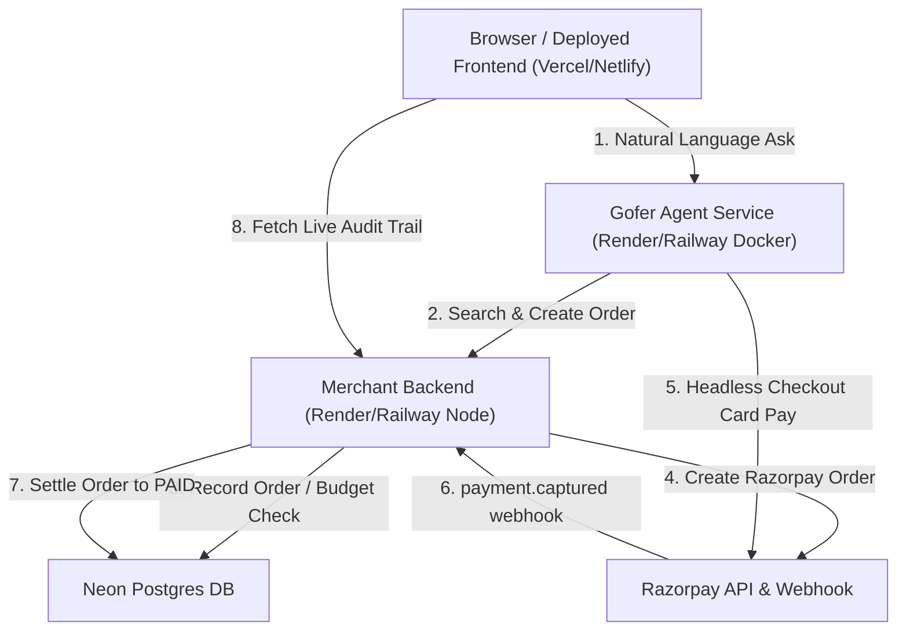

# Gofer — Phase 8 Production Deployment Guide

This guide walks through deploying the three services of Gofer to production with live HTTPS URLs, updating Razorpay's webhook, and verifying the end-to-end purchasing pipeline.

---

## 1. Deploy Merchant Service (`merchant/`)

Deploy to a persistent Node host (e.g. [Render](https://render.com) or [Railway](https://railway.app)). Do **not** deploy to a serverless platform (Vercel Serverless/AWS Lambda) because the webhook listener and budget checks require a persistent, predictable environment.

### Deployment Settings (Render / Railway)
- **Repository**: `https://github.com/ReshenderPratapSingh/Gofer`
- **Root Directory**: `merchant`
- **Environment**: Node
- **Build Command**: `npm install && npm run build` (runs `prisma generate`)
- **Start Command**: `node server.js`

### Environment Variables
Configure these in the hosting dashboard:
| Variable | Value / Description |
| :--- | :--- |
| `DATABASE_URL` | Pooled Neon Postgres connection string from your Neon dashboard |
| `DATABASE_URL_UNPOOLED` | Direct/unpooled Neon Postgres connection string |
| `RAZORPAY_KEY_ID` | Your Razorpay test Key ID (`rzp_test_...`) |
| `RAZORPAY_KEY_SECRET` | Your Razorpay test Key Secret |
| `RAZORPAY_WEBHOOK_SECRET` | Your chosen secret for Razorpay webhooks |
| `MAX_BUDGET_PAISE` | `900000` (₹9,000.00 hard wall) |
| `FRONTEND_URL` | Deployed frontend URL (e.g. `https://gofer.vercel.app`) |
| `PUBLIC_BASE_URL` | (Optional) Merchant service HTTPS URL (e.g. `https://gofer-merchant.onrender.com`). If omitted, auto-derived from request headers. |

> **Note**: Do not run `prisma migrate deploy` unless setting up a brand new DB. The existing Neon DB instance already contains the schema and seed products.

Once deployed, note your Merchant URL: `https://<merchant-host>` (e.g., `https://gofer-merchant.onrender.com`).

---

## 2. Deploy Agent Service (`agent/`)

The agent service orchestrates Gemini and spawns Puppeteer for headless payment completion.

### Recommended Path: Docker Deployment (Guaranteed Linux Shared Libraries)
Using the repository's `Dockerfile` ensures Debian's precompiled Chromium and all required graphic/audio libraries (`libnss3`, `libatk`, `libgbm1`, etc.) are preinstalled:

- **Repository**: `https://github.com/ReshenderPratapSingh/Gofer`
- **Root Directory**: Leave blank (repository root)
- **Runtime / Environment**: `Docker`
- **Dockerfile Path**: `./Dockerfile`
- **Instance Size**: Minimum 512MB RAM, **1GB recommended** (Puppeteer headless browser requires ~300-500MB during card payment submission).

### Environment Variables
Configure these in the hosting dashboard:
| Variable | Value / Description |
| :--- | :--- |
| `GEMINI_API_KEY` | Your Google Gemini API Key |
| `GEMINI_MODEL` | `gemini-3.6-flash` |
| `MERCHANT_BASE_URL` | Deployed Merchant HTTPS URL (e.g. `https://gofer-merchant.onrender.com`) |
| `FRONTEND_URL` | Deployed frontend URL (e.g. `https://gofer.vercel.app`) |
| `HEADLESS` | `true` |

Once deployed, note your Agent URL: `https://<agent-host>` (e.g., `https://gofer-agent.onrender.com`).

---

## 3. Deploy Frontend Control Panel (`frontend/`)

Deploy to a static hosting platform (e.g. [Vercel](https://vercel.com) or [Netlify](https://netlify.com)).

### Deployment Settings (Vercel)
- **Framework Preset**: Vite
- **Root Directory**: `frontend`
- **Build Command**: `npm run build`
- **Output Directory**: `dist`

### Build Environment Variables
Set these **before** triggering the production build so Vite bakes them into the static bundle:
| Variable | Value |
| :--- | :--- |
| `VITE_MERCHANT_URL` | `https://<merchant-host>` |
| `VITE_AGENT_URL` | `https://<agent-host>` |

> **SPA Routing**: The repository includes `frontend/vercel.json` with rewrite rules so that deep links and page refreshes load `index.html` without 404 errors.

---

## 4. Reconfigure Razorpay Webhooks

1. Log into your [Razorpay Dashboard](https://dashboard.razorpay.com/#/access/webhooks).
2. Go to **Settings** → **Webhooks**.
3. **Delete** any obsolete ngrok endpoints (e.g., `https://...ngrok-free.app/webhook/razorpay`) to stop dead delivery retries.
4. Click **+ Add New Webhook**:
   - **Webhook URL**: `https://<merchant-host>/webhook/razorpay`
   - **Secret**: Must exactly match your `RAZORPAY_WEBHOOK_SECRET` environment variable.
   - **Active Events**: Check `payment.captured`.
5. Click **Create Webhook**.

---

## 5. Tighten CORS

Once your frontend is deployed (e.g., `https://gofer.vercel.app`):
1. In the Merchant service dashboard, set `FRONTEND_URL=https://gofer.vercel.app`.
2. In the Agent service dashboard, set `FRONTEND_URL=https://gofer.vercel.app`.
3. Redeploy or restart both services. Both servers will now strictly enforce that only your frontend (and local dev on `localhost:5173`) can call their APIs.

---

## 6. End-to-End Verification Checklist

Perform these tests on the live public URL:

1. **Verify Idle State**:
   - Visit `https://<frontend-url>`.
   - Verify dynamic hard cap is loaded from `GET /api/config` (e.g. ₹9,000.00).
   - Verify audit trail displays previous history from Neon Postgres.

2. **Verify Full Purchase Run**:
   - Enter directive: `"Get me a study chair under ₹9,000, delivered this week"` and click **Send to Gofer**.
   - Watch live timeline stream SSE events: `search_products`, candidate selection, `request_human_approval`.
   - In the **Approval Gateway**, review candidate item and click **Approve**.
   - Watch `complete_payment` stream line-by-line headless checkout logs as Chromium enters test card details on the cloud container.
   - Verify success pill appears: `PAYMENT_CAPTURED`.

3. **Verify Webhook Delivery**:
   - In Razorpay Dashboard → **Webhooks** → click your webhook → **Delivery Logs**.
   - Verify `payment.captured` event was delivered with **Status: 200 OK** to `https://<merchant-host>/webhook/razorpay`.

4. **Verify Database Audit Trail**:
   - Refresh the frontend page.
   - Confirm the new row appears in the Postgres Audit Trail with action `PAYMENT_SUCCESS`, order status `PAID`, and valid Razorpay Payment ID.

5. **Verify Security / Zero Secrets**:
   - Open Chrome DevTools → Network & Sources.
   - Confirm no Gemini API keys, Razorpay secret keys, or database connection strings exist anywhere in shipped files.
