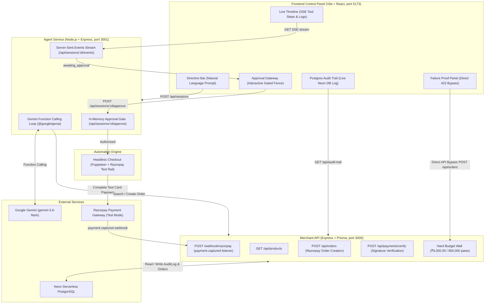

# Gofer — Autonomous AI Purchasing Agent
> Built for the Razorpay Hackathon.

Gofer is an autonomous purchasing agent that procures products on behalf of a human buyer while enforcing two uncompromisable safety fences:
1. **BOUNDED**: A server-enforced hard budget ceiling (`MAX_BUDGET_PAISE`) that lives strictly in the merchant backend and can never be overridden by client requests or model prompts.
2. **GATED**: A strict, blocking human-in-the-loop approval gate requiring explicit authorization before any order placement or card payment can begin.

Every decision, tool invocation, and webhook capture is written to an immutable PostgreSQL audit trail with verbatim model rationale.

---

## Architecture Overview



### Component Structure
- **[`frontend/`](file:///Users/reshendrapratapsingh/my_project/Gofer/frontend/)**: Editorial single-page application (React + Vite + Tailwind CSS) providing a real-time command center for observing the agent's live trace, reviewing candidate purchases, and reading the live Postgres audit log.
- **[`agent/`](file:///Users/reshendrapratapsingh/my_project/Gofer/agent/)**: Express service wrapping `@google/genai` function calling with real-time SSE streaming and an in-memory interactive approval resolver. Also callable directly via CLI (`node agent/src/index.js "..."`).
- **[`merchant/`](file:///Users/reshendrapratapsingh/my_project/Gofer/merchant/)**: Express + Prisma backend representing Meera's Store. Holds the server-enforced budget wall, Razorpay order initialization, test bridge page, and signature-verified webhook handler.
- **[`automation/`](file:///Users/reshendrapratapsingh/my_project/Gofer/automation/)**: Autonomous headless checkout script driving Razorpay's modal with zero manual clicks using real test card instruments.

---

## Quick Start (Local Setup)

### Prerequisites
- Node.js >= 18
- Neon Postgres database ([console.neon.tech](https://console.neon.tech))
- Google Gemini API key ([aistudio.google.com/apikey](https://aistudio.google.com/apikey))
- Razorpay test account ([dashboard.razorpay.com](https://dashboard.razorpay.com))

### 1. Clone & Install Dependencies
```bash
git clone https://github.com/ReshenderPratapSingh/Gofer.git
cd Gofer

# Install dependencies for all services
npm run install:all
```

### 2. Configure Environment Variables
Each directory has a pre-configured `.env.example` template:

```bash
cp merchant/.env.example merchant/.env
cp agent/.env.example agent/.env
cp frontend/.env.example frontend/.env
```

Populate the required credentials in each `.env` file:
- **`merchant/.env`**: Set `DATABASE_URL`, `DATABASE_URL_UNPOOLED`, `RAZORPAY_KEY_ID`, `RAZORPAY_KEY_SECRET`, and `RAZORPAY_WEBHOOK_SECRET`.
- **`agent/.env`**: Set `GEMINI_API_KEY` and confirm `GEMINI_MODEL=gemini-3.6-flash`.
- **`frontend/.env`**: Defaults to `http://localhost:3000` (merchant) and `http://localhost:3001` (agent).

### 3. Generate Prisma Client
```bash
npm run build:merchant
```

### 4. Start the Services
Run each service in a separate terminal:

```bash
# Terminal 1: Merchant Service (Port 3000)
npm run start:merchant

# Terminal 2: Agent Service (Port 3001)
npm run start:agent

# Terminal 3: Frontend Web UI (Port 5173)
npm run start:frontend
```

Open [http://localhost:5173](http://localhost:5173) in your browser.

---

## Interactive Demo Scenarios

The UI provides pre-configured evaluation vectors to demonstrate Gofer's fences against live APIs:

1. **Happy Path (Active Run → Approve → Captured Payment)**:
   - Directive: *"Get me a study chair under ₹9,000, delivered this week"*.
   - Gofer searches the catalog, selects the best matching candidate, presents reasoning, and genuinely pauses at the **Approval Gateway**.
   - Click **Approve**: Puppeteer launches, fills the Razorpay test card, completes verification, and records the captured payment in Neon DB.
2. **Operator Declined (Gated Fence Proof)**:
   - In the Approval Gateway, click **Decline**.
   - Gofer aborts immediately with clean exit, creates zero Razorpay orders, and incurs zero charges.
3. **Independent 422 Budget Wall (Bounded Fence Proof)**:
   - Click **"Verify: budget refusal"** in the Failures Handled panel.
   - Calls `POST /api/orders` directly for an over-budget item (e.g. ₹32,000 Zero-Gravity Chair), bypassing Gofer entirely.
   - The merchant returns `422 budget_exceeded` and logs a `REFUSAL` row in Postgres.
4. **CLI Mode (Backward Compatible)**:
   ```bash
   node agent/src/index.js "Get me a study chair under ₹9,000"
   ```

---

## Production Deployment

Gofer is fully production-ready and includes:
- **[`render.yaml`](file:///Users/reshendrapratapsingh/my_project/Gofer/render.yaml)**: Blueprint for one-click deployment on Render with Docker-based Chromium support.
- **[`Dockerfile`](file:///Users/reshendrapratapsingh/my_project/Gofer/Dockerfile)**: Container build prepackaging Debian Chromium and all required shared libraries.
- **[`frontend/vercel.json`](file:///Users/reshendrapratapsingh/my_project/Gofer/frontend/vercel.json)**: SPA rewrite rules for static deployment on Vercel or Netlify.

👉 For step-by-step instructions on deploying the Merchant, Agent, and Frontend services to public HTTPS URLs, updating Razorpay webhooks, and locking down CORS, see the **[Production Deployment Guide](file:///Users/reshendrapratapsingh/my_project/Gofer/DEPLOYMENT_GUIDE.md)**.
